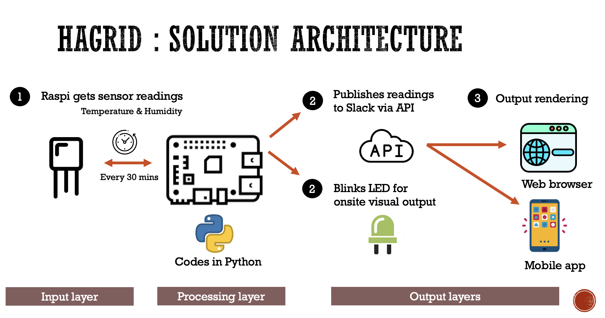
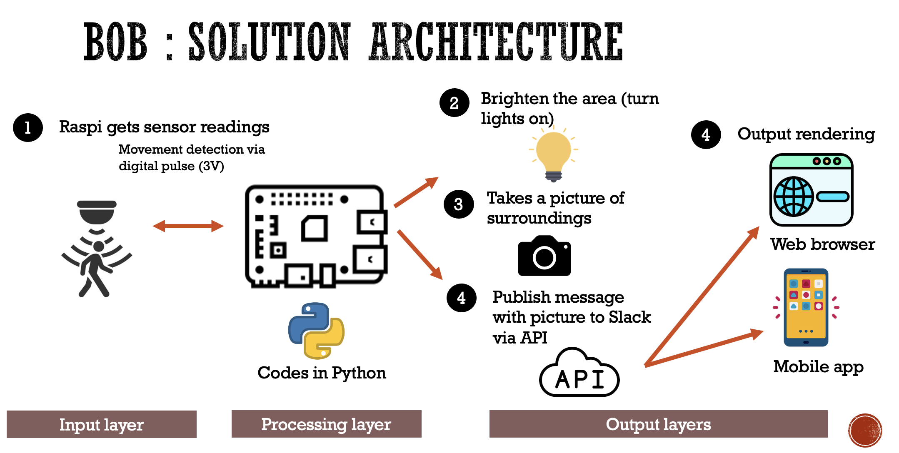

# Raspberry Pi and Python projects

This repo is a set of Raspberry Pi projects powered by Python. It aims to give students of South Houston High School sample engineering projects that are integrated with cloud-native services. More info at [engineering deck](https://github.com/bencarpena/shhs-shared/blob/main/docs/Sharing_Raspi-Python_Projects.pdf).

## Architecture

End-product surfaces are built on a shared set of data, models, and software frameworks. The shared components included in this repository (which are implemented in the solutions) are listed below:

| Type | Component | Description |
|------------|------------|------------|
| Data | AM2302 Temperature & Humidity sensor | Real-time stream of Raspberry PI sensor data |
|      | PIR sensor | Real-time stream of Raspberry PI sensor data |
| Software Framework | [hagrid](/hagrid.py) | Hagrid algorithms in Python3 |
|       | [bob](/bob.py) | Bob algorithms in Python3 |
|       | Slack | Real-time messaging and output via Slack's event-triggered API (webhooks) |
|       | Raspian GNU/Linux | Operating System |
| Hardware Framework | Raspberry Pi | Raspberry PI 3 Model B+ |
|                    | Output | LED | 
|                    | Input | AM2302 sensor, PIR sensor, Camera |

The product surface currently included in this repository is the For You Timeline.

### Solution Diagram

**Hagrid**

**Bob**

## Contributing

I invite the community to submit GitHub issues and pull requests for suggestions on improving the project specs, codes and overall algorithm. 

[@bencarpena](https://twitter.com/bencarpena)